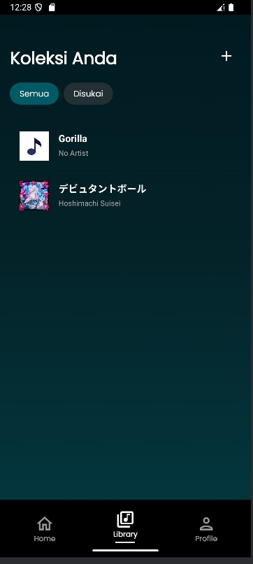

# Tugas Besar Android IF3210 Pengembangan Aplikasi Piranti Bergerak 2024/2025
> Aplikasi Purritify by Kelompok 13 K01

## Daftar Konten
* [Deskripsi Aplikasi](#deskripsi-aplikasi)
* [Library](#library)
* [Dokumentasi Aplikasi](#dokumentasi-aplikasi)
* [Pembagian Tugas](#pembagian-tugas)
* [Jam Pengerjaan](#jam-pengerjaan)

## Deskripsi Aplikasi
Purrity merupakan aplikasi penyetel lagu secara _online_ pada piranti bergerak. Bukan hanya mendengarkan lagu, 
pengguna juga dapat menambah lagu dan menyukai lagu. Aplikasi pun memiliki fitur untuk menampilkan lagu terbaru dan lagu yang baru disetel oleh pengguna.

## Library
- UI Framework: Jetpack Compose
- Dependency Injection: Koin
- Networking: Retrofit, OkHttp
- Local Storage: RoomDB, DataStore
- Image Loader: Glide
- Utility: RecyclerView, Accompanist, Coroutines

## Dokumentasi Aplikasi
1. Navbar  
   

2. Login Page  
   

3. Home Page  
   

4. Library  
   

5. Profile Page  
   

6. Liked songs  
   

7. Music player  
     
   

8. Notif Controls
   

9. Responsive Pages
   

10. Share Song
   

11. Edit Profil
   

12. Audio Routing
   

13. Online Songs
   

14. Recommendation
   

15. Sound Capsule
   

16. Upload Song
   

## Pembagian Tugas
| NIM      | Nama                      | Tugas                                                                        |
|----------|---------------------------|------------------------------------------------------------------------------|
| 13522007 | Irfan Sidiq Permana       | Header dan Navbar, Home, Library, Pemutaran dan Penambahan lagu, Liked songs, Notif Controls, Audio Routing, Sound Capsule, Online Songs & Download |
| 13522033 | Bryan Cornelius Lauwrence | Login, Logout, Background Service, Edit Profil, Recommendation, Share Song                                            |
| 13522041 | Ahmad Hasan Albana        | Profile, Network sensing, Responsive                                                     |

## Jam Pengerjaan
| NIM      | Jam Persiapan | Jam Pengerjaan |
|----------|---------------|----------------|
| 13522007 | 10 jam        | 60 jam         |
| 13522033 | 6 jam         | 55 jam         |
| 13522041 | 6 jam         | 30 jam         |
